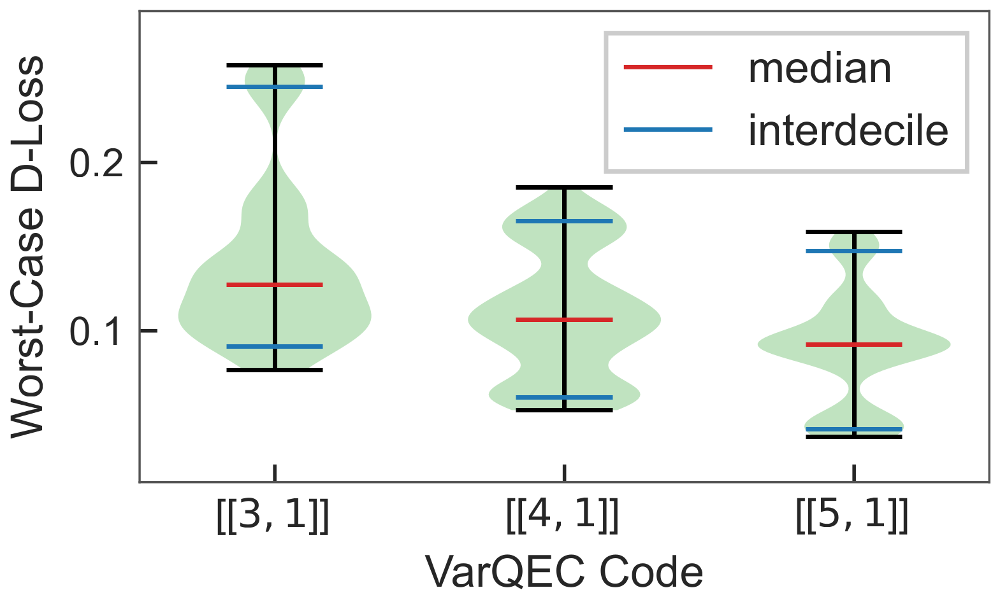

# Variational Quantum Error Correction (VarQEC) -- Hardware Experiment

[
](https://arxiv.org/search/quant-ph?query=Meyer%2C+Nico&searchtype=author&abstracts=show&order=-announced_date_first&size=50)[
](https://github.com/nicomeyer96/varqec)

This repo contains the code for the hardware experiments in the paper ["Learning Encodings by Maximizing State Distinguishability: Variational Quantum Error Correction", N. Meyer et al., arXiv:2506.11552, 2025](https://arxiv.org/abs/2506.11552).
The implementation of the overall pipeline is available at this [GitHub repository](https://github.com/nicomeyer96/varqec).

> [...]. We also provide proof-of-concept demonstrations on IBM and IQM hardware devices, highlighting the practical 
> relevance of our procedure.



## Setup and Installation

This codebase requires an installation of `python v3.12` and following libraries:
- ```pennylane v0.39.0```
- ```torch v2.4.1```
- ```numpy v2.0.2```
- ```configargparse v1.7```

Additionally, for the circuit conversion and execution on hardware:
- ```qiskit v1.1.0```
- ```qiskit-aer v0.14.2```
- ```qiskit-experiments v0.8.1```
- ```qiskit-ibm-runtime v0.34.0```
- ```qiskit-iqm v15.6```

We recommend setting up a conda environment and install the required packages as follows:

```
conda create --name ENV_NAME python=3.12
conda activate ENV_NAME
pip install -r requirements.txt
```

## Submitting and Retrieving Results from Hardware

> **Note:** <br/>
> Submitting and retrieving the results form IBM Quantum or IQM Resonance services requires to set a personal API token in the respective implementation.
> Running the respective experiments requires access to tha hardware that is likely beyond open access plans. We estimate
> that running the 4-qubit experiments on IBM hardware takes about 25 QPU-minutes, while the 5-qubit version requires 75 QPU minutes.
> We also provide raw data from already conducted experiments that can be further analyzed.

The VarQEC codes we deploy on hardware are stored in `models/` and have been trained with our [VarQEC module](https://github.com/nicomeyer96).

One can submit these to IBM Quantum services by running
```
python experiment_ibmq.py --wires 4 --delay 0.005 --shots 10000 --submit
```
and to IQM Resonance services via
```
python experiment_iqm.py --wires 4 --delay 0.001 --shots 1000 --submit
```

This submits results in a non-blocking fashion and stores the respective job_ids to `experimen\result\`.

To subsequently retrieve the results from hardware after the jobs have completed, one has to run the same script,
but with the flag `--retrieve`.
If cluster re-sampling techniques should be used ir is possible to set `--resample` to a value greater than 0.

## Analyzing the Results

The results that have been retrieved in the previous step have also been stored to `experimen\result\`.
We also provide the raw data from our experiments that can be further analyzed.

For that, one just has to run
```
python experiment_ibmq.py --wires 4 --delay 0.005 --shots 10000
```
for the IBM experiments and
```
python experiment_iqm.py --wires 4 --delay 0.005 --shots 10000
```
for the IQM experiments.

The result should look something like the following:
```
Loaded baseline states with 3 patches and 4 wires per patch.
Loaded states with 3 patches, each on 4 wires.

Patch #0: best=0.088, avg=0.256     <- best worst/avg-case loss of a physical qubit
Wire `d`: loss=0.095, `a0`: loss=0.180, `a1`: loss=0.659, `a2`: loss=0.088
Encoding: loss=0.132                <- worst-case loss of the encoding patch

Patch #1: best=0.069, avg=0.089
Wire `d`: loss=0.069, `a0`: loss=0.096, `a1`: loss=0.096, `a2`: loss=0.097
Encoding: loss=0.036

Patch #2: best=0.082, avg=0.094
Wire `d`: loss=0.110, `a0`: loss=0.099, `a1`: loss=0.085, `a2`: loss=0.082
Encoding: loss=0.051

```

## Acknowledgements

We acknowledge the use of parts of the [`qiskit_experiments` module](https://qiskit-community.github.io/qiskit-experiments/) to conduct the mitigated state tomography.

We acknowledge the use of [IBM Quantum services](https://quantum.ibm.com/) for this work. The views expressed are those of the authors and do not 
reflect the official policy or position of IBM or the IBM Quantum team.

We acknowledge the use of [IQM Resonance services](https://resonance.meetiqm.com/) for this work. The views expressed are those of the authors and do not 
reflect the official policy or position of IQM or the IQM Resonance team.

**Funding:** The research was supported by the [Bavarian Ministry of Economic Affairs, Regional Development and Energy](https://www.stmwi.bayern.de/) with funds from
the Hightech Agenda Bayern via the project [**BayQS**](https://www.iis.fraunhofer.de/de/profil/das-koennen-wir-fuer-sie-tun/zukunftsinitiativen/quantentechnologien/bayqs.html).

## Citation

If you use this implementation or results from the paper, please cite our main work as

```
@article{meyer2025learning,
  title={Learning Encodings by Maximizing State Distinguishability: Variational Quantum Error Correction},
  author={Meyer, Nico and Mutschler, Christopher and Maier, Andreas and Scherer, Daniel D.},
  journal={arXiv:2506.11552},
  year={2025},
  doi={10.48550/arXiv.2506.11552}
}
```

## License

Apache 2.0 License
